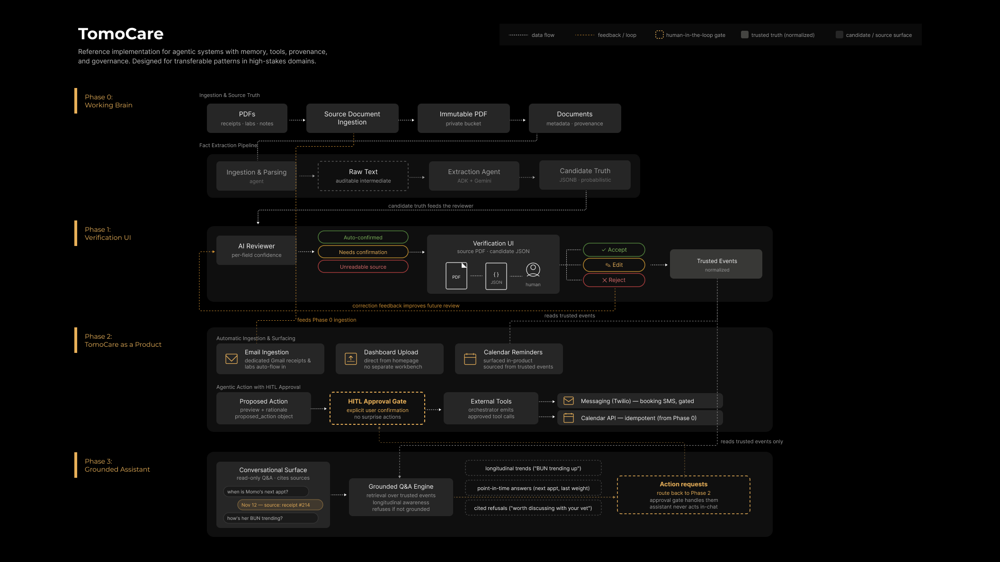

# TomoCare

> A governed AI system that turns scattered pet-care documents into trusted, actionable records without taking the human out of the loop.

TomoCare is a personal AI build for one real user: my dog, Momo.

It ingests vet receipts, lab reports, and visit notes; extracts the facts that matter; and only after human verification promotes them into structured records the system can reason over and act on. Today, that includes verified timelines, cost records, Librela reminders, and calendar sync. The larger goal is to explore how agentic systems can handle high-stakes document workflows with provenance, approval gates, and durable memory.

**Status:** Work in progress. Phases 0–2 and the governed Phase 3 assistant foundation are shipped. Phase 3D is building the conversation-centered product experience.



## Core idea: three tiers of truth

TomoCare does not treat AI output as fact. Data moves through three deliberate trust layers:

| Tier                | What it is                                               | Trust level      |
| ------------------- | -------------------------------------------------------- | ---------------- |
| **Source truth**    | Original PDFs stored in private Supabase Storage         | Immutable source |
| **Candidate truth** | AI-extracted JSON stored for inspection and debugging    | Unverified       |
| **Trusted truth**   | Materialized database rows used for logic and automation | Human-approved   |

The system is built around three guardrails:

* Every trusted record links back to its source document.
* Candidate truth cannot trigger external actions on its own.
* Any action that leaves the system, such as messaging or booking, requires explicit approval.

These patterns are designed to transfer beyond pet care into other high-stakes document workflows where provenance, review, and controlled automation matter.

## What works today

### Phase 0 — Working Brain

Shipped the underlying ingestion and memory layer:

* Private PDF storage in Supabase
* Document records with stable storage keys
* Raw text extraction as an auditable intermediate
* AI extraction into structured JSON candidate truth
* Materialization into trusted event and cost records
* Deterministic Librela reminder logic
* Google Calendar sync with persisted external references to prevent duplicates

### Phase 1 — Verification UI

Shipped a human-in-the-loop review workflow:

* Review queue for documents awaiting verification
* Side-by-side source PDF and extracted data
* AI triage that flags fields as auto-confirmed, needs review, or unreadable
* Editable candidate truth before approval
* Save draft and save-and-verify flows
* Approval-gated materialization into trusted records

## In progress

### Phase 2 — TomoCare as a Product

Currently building the product layer:

* Dashboard view for upcoming care, documents, and reminders
* Gmail ingestion through a dedicated TomoCare inbox
* Automatic receipt/lab intake into the existing verification pipeline
* Notification card for documents needing review
* First approval-gated agentic action: draft an appointment request, send only after approval, parse the response, and write the result back to the calendar

## Planned

### Phase 3 — Grounded Assistant

A bounded conversational layer that answers only from trusted records:

* “When is Momo’s next Librela shot?”
* “What was her last weight?”
* “How much have I spent on Librela this year?”
* “Which lab values were abnormal in the latest panel?”

The assistant will cite source documents and route any action request back through the approval gate.

## What TomoCare is not

* Not a diagnostic tool or a replacement for a veterinarian.
* Not an autonomous black-box agent.
* Not a polished consumer app.
* Not a system where AI output silently becomes operational truth.

Correctness, provenance, and governance come before polish.

## Stack

* **Frontend:** React
* **Backend:** Node, Express
* **Agent / tools:** Python, Google ADK, Gemini
* **Database / storage:** Supabase Postgres, Supabase Storage
* **AI review:** Anthropic API
* **Calendar automation:** Google Calendar API
* **In progress:** Gmail API ingestion
* **Planned:** Twilio messaging, MCP-exposed tools

## Design principles

* **Provenance first:** Every derived fact should trace back to a source document.
* **Deterministic before agentic:** Known workflows use explicit rules before model inference.
* **Human approval gates:** The system can assist, but the human decides what becomes trusted.
* **Idempotent automation:** External actions should update existing records instead of creating duplicates.
* **Trust before polish:** The product should be inspectable and correct before it becomes polished.

## Repo note

This project uses real pet-care data in development, so private PDFs, API keys, OAuth tokens, and environment files are not included in the repository.

## Voice troubleshooting

TomoCare records from the microphone selected by the browser and operating
system. On a Mac, an iPhone may take over as the input through Continuity
Camera. If Tomo does not hear the Mac microphone:

1. In macOS, open **System Settings → Sound → Input** and select the Mac
   microphone.
2. Reload the TomoCare browser tab and allow microphone access.
3. If the iPhone still takes over, temporarily turn off **Settings → General →
   AirPlay & Continuity → Continuity Camera** on the iPhone.

Voice recording stops automatically after Tomo detects speech followed by a
short pause. The Stop button remains available as a manual fallback.

## Gmail authorization recovery

If **Check inbox** reports that Tomo's inbox key stopped working, Google's
saved Gmail authorization is no longer valid. Generate a new refresh token:

```bash
node server/scripts/get-gmail-refresh-token.js
```

Open the printed authorization URL, complete consent, replace
`GMAIL_REFRESH_TOKEN` in the local `.env`, and restart TomoCare. Keep the token
out of source control and chat.

For an external OAuth app left in Google's **Testing** publishing state, this
may recur every seven days. Moving the OAuth consent screen to **In production**
prevents that specific test-token expiration.

## Semantic understanding

TomoCare routes explicit supported questions and all governed actions through
the existing deterministic planner first. A schema-constrained OpenAI request
may map otherwise unknown phrasing to one supported read-only intent and may
also return bounded, fact-free personality language. The request uses `store:
false` and includes no trusted records, composed answers, citations, or action
payloads.

Semantic interpretation uses the existing server-only `OPENAI_API_KEY`.
The default model is `gpt-5.6-terra`; it can be changed locally with:

```text
TOMO_SEMANTIC_MODEL=gpt-5.6-terra
```

Conversation context is intentionally limited to the previous supported care
intent and subject. It is held in the browser session only and is not written
to the database.

## Personality and relationship context

TomoCare keeps a small, versioned relationship profile separate from verified
care records. It contains only intentional stable details about Rosa, Momo, and
Tomo's communication style. It is not medical evidence and cannot create or
change trusted care history.

For an ordinary grounded question, the model may add one short, fact-free
opening or closing around the deterministically composed answer. The grounded
answer remains an unchanged contiguous part of the final response. Medical
judgment, pain, health uncertainty, clarification, message drafts, and governed
actions always use restrained mode. Personality never changes facts, citations,
limitations, or action status.

For harmless conversation—greetings, thanks, praise, corrections, frustration,
and goodbyes—the model may write a fresh response of no more than two short
sentences. Server validation rejects language containing numbers, amounts,
care-record claims, medical conclusions, or claims that an action occurred.
Small deterministic response pools remain available only when OpenAI is
unavailable, the interpretation does not match the locally recognized intent,
or generated language fails validation. Social replies never load care records.

Tomo's capability description and Momo's profile remain deterministically
assembled because they make factual claims about the product and relationship
profile.

Tomo can also describe Momo from the bounded relationship profile without
confusing her with Tomo or treating family details as medical evidence. Weight
trend answers lead with a factual pattern and key comparisons instead of
reciting every data point. Named-month calendar questions filter the primary
reminder list to that month; an earlier still-active reminder may be called out
separately so it is not misrepresented as part of the requested month.

## Conversational home

The Phase 3D home makes Tomo and the current conversation the primary product
surface. A collapsible care navigation and contextual drawer keep Momo's
profile, reminders, inbox, and recently verified documents available without
turning the experience back into a dashboard grid. Closing either sidebar area
reallocates its width to the Voice/Chat canvas.

Voice is the default mode. Voice and Chat share one session-only transcript, so
switching modes does not restart the conversation. Refreshing the page or using
Clear starts a new session; clearing also resets the bounded previous-topic
anchor. Verified records, citations, reminder actions, and approval dialogs
continue to use the existing governed backend.

Voice uses an immersive, avatar-first stage rather than the information-dense
Chat layout. The stage stays visually quiet, while the full scrollable transcript
opens from the floating control dock with citations and reminder evidence intact.
When that panel opens, Tomo and the dock recenter within the remaining stage so
the avatar stays conversationally present instead of being covered. Listening,
thinking, speaking, playback, and mute controls remain in the dock. The stage
media is isolated behind one avatar-media seam so the current high-resolution
placeholder can later be replaced by a Runway character stream without changing
conversation, voice, transcript, or governance behavior.

Chat starts directly at the session boundary and uses a multiline composer.
Enter sends; Shift+Enter adds a new line. Tomo's visible identity uses the
TomoCare logo in both the voice presence and transcript. Reminder citations
resolve against the same loaded reminder records as the contextual drawer, so
timing status, display date, and Google Calendar links remain consistent across
both surfaces.

Compact reminder cards preserve complete category eyebrows, medication names,
and care-specific icons for quick scanning. Calendar sits in a dedicated footer
below a divider and remains the final card row when details expand. It opens the
specific Google Calendar event when TomoCare has its URL, or Google Calendar
itself when no event link is stored. Calendar sync remains a separate explicit
action. User-facing record and reminder dates use `MM-DD-YYYY`; database values,
API payloads, and editable schema fields remain ISO `YYYY-MM-DD` so care logic
and validation do not change.

Momo's profile reads safe identity fields from the `pets` table. Displayed age
is calculated from `birth_date` at runtime and changes on her birthday; it is not
stored as a fixed number in the interface.

Assistant coverage is intentionally narrower than the visible product surface
today. A follow-up slice will define question coverage, freshness, and privacy
rules for Profile, Reminders, Inbox, Recently verified, and pending approvals
before Tomo claims knowledge of every item shown in the app.
