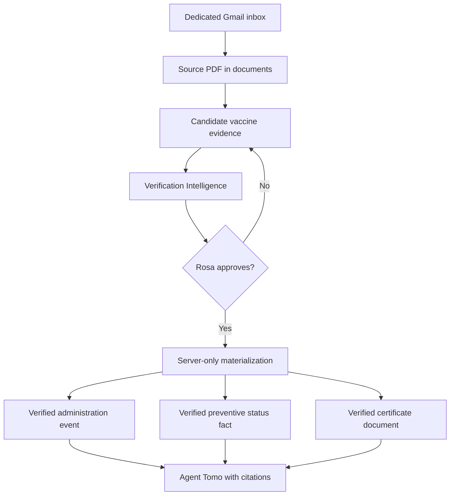

# Phase 3E.7a — Verified Rabies Evidence Foundation

## Outcome

Phase 3E.7a makes one bounded preventive-care slice work end to end:

1. A veterinary PDF arrives through Tomo's dedicated Gmail inbox.
2. Tomo stores the source document and extracts candidate fields.
3. Verification Intelligence compares the candidate with the source and trusted history.
4. Rosa reviews the grouped Rabies evidence and explicitly approves it.
5. A server-only transaction materializes certificate-backed administration and clinic-reported preventive status as separate trusted records.
6. Agent Tomo can answer when the Rabies vaccine was administered, report the clinic's next-due date, and return the verified certificate PDF with citations.

This is a real-care foundation with a strict Rabies allowlist. The candidate array, provenance model, and trusted-record mapping can support additional vaccines later without rewriting the core contract.

## Trust flow



## Product and architecture decisions

| Concern | Phase 3E.7a decision |
|---|---|
| Gmail filenames | Ingest receipts, invoices, vaccine/certificate names, and otherwise-unknown PDFs from the dedicated veterinary inbox. Known duplicate invoice breakdowns remain skipped. |
| Email vs. clinical provenance | Gmail sender/forwarder identity stays in `external_refs` as transport provenance. It never seeds `source_org`; the clinical organization must be extracted from the attached document and reviewed by Rosa. |
| Interrupted processing | A PDF row that remains `ingested` is retryable on the next explicit **Check inbox** action. Reviewed or verified content remains deduplicated. The dashboard names any PDF that still fails. |
| Receipt extraction recovery | Receipt extraction requests JSON explicitly and allow additional output space for multi-page receipts. If structured extraction still fails after readable PDF text is saved, Tomo routes an empty, untrusted candidate into **Needs review** so Rosa can inspect the PDF and add fields manually. |
| Failure guidance | Intake failures identify the processing stage and provide **Retry processing** and **Open saved PDF** actions. Provider errors and extracted clinical content are not returned to the dashboard. |
| Verification timeout recovery | Source comparison has a 45-second provider budget inside the specialist's 60-second budget. If comparison takes too long, Tomo persists a fail-safe assessment instead of discarding the review. Every candidate field remains untrusted and requires human confirmation. |
| Recovery controls | Verify Docs states what was saved and what was not approved, then offers **Retry AI review**, **Continue with manual review**, and **Review later**. A hard handoff failure never pretends that manual approval is ready. |
| Manual recheck | Every unverified document with saved candidate data also shows **Recheck with AI** beside the normal editing controls. It reruns the existing bounded assessment without approving or materializing records. Verified documents remain read-only. |
| Trust boundary | Ingestion and extraction create candidates only. No PDF becomes trusted without current-source review and Rosa's approval. |
| Correctable clinic | `source_org` appears as **Clinic** in Edit mode. Saving invalidates the prior review, and approval promotes the corrected clinic to the verified document used by Agent Tomo and citations. |
| Review preservation | After a correction, an accepted field remains accepted only when its extracted value and risk state are unchanged in the new assessment. The edited field and any changed or newly risky fields require review again. |
| Post-verification actions | Vaccination certificates do not offer or permit insurance-claim reminders. Existing receipt/invoice actions retain their prior governed eligibility rules. |
| Pilot scope | Only `care_item: rabies` may materialize. Other vaccines remain visible as “seen in source · not captured.” |
| Administration | Requires an `administration` assertion from `source_record_type: vaccination_certificate`. Receipt/reminder text cannot establish administration. |
| Next due | Stored as the clinic-reported `next_due` assertion and a `preventive_care_status` fact. It is not a reminder or Tomo-calculated schedule. |
| Clinic status | Stored only when the clinic explicitly states it. Tomo does not infer “current,” “due,” or “overdue” from the clock or next-due date. |
| Product expiration | Stored as `product_expiration_date` inside certificate/event product metadata. It is never used as Momo's vaccine expiration or next-due date. |
| Duplicate evidence | A receipt and certificate with the same Rabies next-due date share one current fact and accumulate supporting document IDs. The certificate becomes the primary citation source. |
| Conflicting evidence | A different trusted next-due date blocks review/materialization. Tomo does not silently choose a source. |
| Agent answers | “When given?” reads the certificate-backed event. “When due?” reads the preventive fact. “Show certificate” reads the verified document. |

## Candidate contract

```json
{
  "schema_version": 1,
  "care_kind": "vaccine",
  "care_item": "rabies",
  "source_record_type": "vaccination_certificate",
  "assertions": [
    {
      "assertion_type": "administration",
      "date": "2026-04-12",
      "date_meaning": "administered_on",
      "source_context": "Synthetic source excerpt"
    },
    {
      "assertion_type": "next_due",
      "date": "2029-04-11",
      "date_meaning": "clinic_reported_next_due",
      "source_context": "Synthetic source excerpt"
    }
  ],
  "product_details": {
    "product_name": "Example Rabies Vaccine",
    "manufacturer": "Demo Animal Health",
    "batch_number": "SYNTHETIC-LOT",
    "product_expiration_date": "2027-01-31"
  }
}
```

The repository tests and examples use synthetic names, dates, and identifiers only.

## Trusted-record mapping

| Candidate meaning | Trusted table | Trusted shape |
|---|---|---|
| Certificate-backed administration | `events` | `event_type = vaccine`, `status = verified`, `details_json.care_item = rabies`, certificate evidence metadata |
| Clinic-reported due/status | `facts` | `fact_type = preventive_care_status`, `status = verified`, `value_json.care_item = rabies` |
| Official source and PDF | `documents` | `doc_type = vaccination_certificate`, `status = verified`, stable `file_url` |

The migration `202608260001_materialize_verified_vaccine_evidence.sql` owns validation, deduplication, provenance accumulation, and trusted writes. Execute permission is limited to the service role.

## Setup

1. Check out `phase-3e-7a-verified-preventive-status`.
2. Apply the new Supabase migration with the project's normal linked migration workflow (for example, `npx supabase db push`) or run the migration in the Supabase SQL editor.
3. Confirm existing Gmail, Supabase, Gemini extraction, and Verification Intelligence environment variables are configured.
4. Restart the application with `npm run dev`.
5. Run `npm run test:phase3e7a` before manual testing.

## Real-document manual test

Keep this test private. Do not use real documents, extracted text, screenshots, personal identifiers, microchip data, clinic contact information, or product batch numbers in the portfolio demo.

1. Forward the Rabies certificate PDF and the other veterinary receipt PDF to Tomo's dedicated Gmail inbox. Do not resend the already-processed 8/3 Librela receipt.
2. In TomoCare, choose **Check inbox** once. A forwarded message is new Gmail activity, so the existing 60-day query should include it.
3. Confirm both PDFs appear in Verify Docs. If structured receipt extraction cannot finish, the receipt must still enter **Needs review** with an **Open saved document** action and no trusted writes. A PDF text-reading failure must instead show its processing stage with **Retry processing** and **Open saved PDF** actions. If source comparison times out, Verify Docs must say the PDF, source text, and extracted fields were saved; nothing was approved or added to trusted records; and show **Retry AI review**, **Continue with manual review**, and **Review later**. Reviewed and verified content remains deduplicated.
4. Open the Rabies certificate and verify the grouped card shows four independent rows:
   - Verified administration
   - Clinic-reported next due
   - Clinic-reported status, only if explicitly printed
   - Product/vial expiration, clearly labeled as product metadata
5. Compare every displayed value with the source PDF. Confirm **Clinic** names the clinical issuer printed in the certificate, not Rosa or another email sender. If it is wrong, choose **Correct** on the Clinic card; the editor should scroll to and focus Clinic. Correct it and choose **Save & recheck**. Previously accepted fields should remain accepted only when their value and review state are unchanged. Do not accept a known-wrong value.
6. Approve the certificate. Confirm one verified Rabies vaccine event and, when a next-due assertion exists, one verified preventive-care fact are materialized.
7. Open the other receipt. Confirm normal receipt fields still work and that **Recheck with AI** is available while the document remains unverified. Triggering it must show an AI-review loading state and must not approve or materialize anything automatically. If the saved assessment is a timeout fail-safe, choose **Continue with manual review**, compare each attention item with the PDF, and accept only matching values. Approval must remain disabled until every blocking item is reviewed. Bordetella, Leptospirosis, DA2PP/DHPP, annual care, and lab mentions must remain “seen in source · not captured” for this slice. The receipt must not create a vaccine administration event or trusted lab result.
8. If the receipt reports the same Rabies next-due date, approve it and confirm the fact count stays at one while provenance gains the second document. If it reports a different date, approval must stop for review rather than selecting either date.
9. Ask Agent Tomo:
   - “When did Momo receive her Rabies vaccine?”
   - “When is Momo's Rabies vaccine due next?”
   - “Show me Momo's Rabies certificate.”
10. Confirm each answer uses the correct trusted record, presents the corrected clinic in its citation, and that the certificate evidence card opens the source PDF.
11. Confirm no reminder, Calendar action, message, appointment, or medical interpretation was created.
12. Confirm the Rabies certificate post-verification modal does not offer an insurance-claim reminder. Receipt/invoice insurance behavior remains outside this preventive-status slice and follows its existing financial-evidence gate.

The supplied real PDFs have readable text layers above the current extraction threshold, so this manual test does not depend on adding OCR in Phase 3E.7a.

## Deliberately excluded

- Additional vaccine materialization
- Preventive reminders or lifecycle actions
- Google/Apple Calendar actions
- Medical interpretation of vaccine status
- Travel or HOA submission workflows
- Lab analyte extraction, Annual Lab analysis, trend intelligence, or clinical conclusions
- OCR for image-only PDFs
- Synthetic portfolio PDFs and public demo media (prepare those in a separate bounded demo-data step using the same contract)
