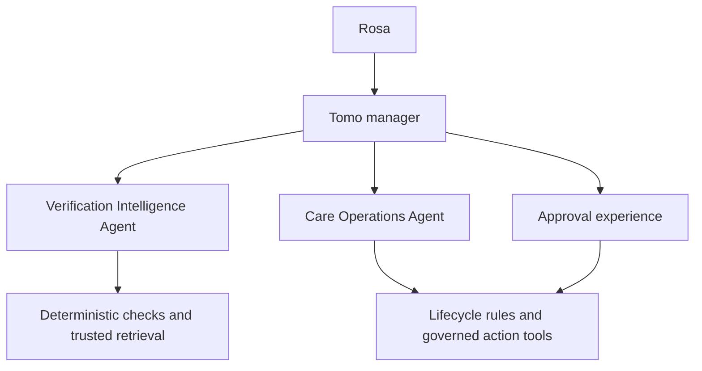

# TomoCare Multi-Agent Orchestration Decision and Build Plan

**Decision date:** August 16, 2026

**Owner:** Rosa Choi

**Status:** Accepted architecture direction; implementation begins with Phase 3E.5

## Decision

TomoCare will evolve into a small, governed **manager-style hybrid multi-agent system**.

Tomo remains the one user-facing manager. Tomo may delegate bounded reasoning work to specialist agents, synthesize their evidence, and guide Rosa through the next governed step. Deterministic services remain responsible for calculations, validation, persistence, idempotency, and external execution.

The first two specialist roles are:

1. **Verification Intelligence Agent** — compares a current document with its source, candidate extraction, deterministic checks, and recent trusted history; then explains meaningful differences and review needs.
2. **Care Operations Agent** — reconciles trusted care events, reminders, and action state; identifies what was completed and what remains; then prepares the next governed action.

This is intentionally not a decentralized swarm. A new agent is justified only when it has a distinct context, reasoning responsibility, permission boundary, failure mode, and evaluation contract.

## Why this is the right boundary

TomoCare already contains much of the foundation an orchestrator needs:

- source, candidate, and trusted truth are separated;
- governed actions have explicit lifecycle state;
- reminders and care actions persist across sessions;
- calculations and idempotency are deterministic;
- Chat and Voice share grounded capabilities;
- external actions require approval;
- failures and recovery paths can be represented explicitly.

What is missing is not a collection of agent personas. It is a formal orchestration layer with specialist contracts, structured handoffs, permission enforcement, durable traces, and agent-specific evals.

The hybrid design preserves the strongest parts of the existing architecture while adding a meaningful orchestration story:

> **Agents reason over ambiguity. Deterministic systems calculate, validate, persist, and execute. Humans approve consequential truth and action.**

## Alternatives considered

| Option | Strengths | Costs and risks | Decision |
| --- | --- | --- | --- |
| Modules and workflows only | Predictable, fast, inexpensive, easy to test | Becomes rigid when a task requires contextual comparison, evidence selection, or flexible sequencing | Continue using for deterministic work |
| One general-purpose agent with tools | Simple user experience and fewer handoffs | Context and tools can become overloaded; permissions and evals become harder to isolate | Tomo remains the manager, not the only reasoner |
| Small manager-style multi-agent system | Clear specialist ownership, bounded context, visible handoffs, separate permissions and evals | More latency, cost, failure handling, and observability work | Chosen direction |
| Decentralized agent swarm | Flexible peer-to-peer collaboration | Harder to predict, govern, debug, and demonstrate; unnecessary for TomoCare's bounded workflows | Rejected for portfolio v1 |

## Defensible agent boundary

A component becomes an agent only when all of the following are true:

1. It must interpret ambiguous or variable evidence rather than apply a fixed rule.
2. It owns a coherent specialist responsibility that can be explained independently.
3. It needs a bounded context different from Tomo's conversational context.
4. It has a distinct read/write or tool permission set.
5. It has failure modes and evals that should be measured separately.
6. Its output can be expressed as a structured handoff rather than hidden shared reasoning.

If those conditions are not met, the capability remains a deterministic module, tool, or workflow step.

## Target architecture

The diagram describes responsibility, not unrestricted call access. Specialists receive only the context and tools allowed by their contract. They return structured results to Tomo. They do not directly promote candidate facts, mutate trusted care state, or execute an external action.

## Responsibility and authority model

| Component | Primary responsibility | May read | May write or execute |
| --- | --- | --- | --- |
| **Tomo manager** | Understand the user's goal, select a specialist, synthesize results, explain limitations, and guide approval or recovery | Approved conversational context and structured specialist results | Orchestration trace and non-consequential presentation state; no direct trusted-care mutation |
| **Verification Intelligence Agent** | Compare the current source and candidate with deterministic checks and recent comparable trusted records; produce summary, diff, and exceptions | Current source text, candidate extraction, review state, deterministic check results, up to five comparable trusted records | Review assessment only; never trusted materialization or external action |
| **Care Operations Agent** | Reconcile verified care events, reminders, and actions; determine what remains and prepare a bounded next step | Trusted events, reminders, action ledger, applicable deterministic lifecycle outputs | Proposed governed action only; execution remains behind existing approval and validation |
| **Deterministic services** | Calculate dates and totals, validate schemas and fingerprints, enforce idempotency, materialize verified records, and call providers | Explicit typed inputs | Only within existing server-side contracts and authorization gates |
| **Rosa** | Correct candidate facts, approve trusted promotion, and approve consequential external action | Source evidence, explanations, proposed payloads, and status | Final human authorization at the established boundaries |

## Phase 3E.5: first formal specialist agent

Phase 3E.5 will implement the **Verification Intelligence Agent** as TomoCare's first formal specialist. The slice remains a document-review capability, not broad orchestration.

### Historical comparison contract

For a comparable current invoice, the agent may use up to the five most recent trusted comparable records. A repeated pattern is established only after at least three consecutive comparable verified records agree on the relevant normalized value.

History is supporting evidence, not authority over the current source. A repeated value may reduce review burden only when:

- the current source clearly supports the value;
- deterministic checks do not identify a conflict;
- the comparison is semantically valid;
- there is no unit, date, identity, or duplicate ambiguity; and
- the field does not require deliberate review under the agreed consequence model.

### Review outcomes

| Outcome | Meaning | User experience | Promotion authority |
| --- | --- | --- | --- |
| **Consistent pattern** | Current evidence matches deterministic checks and an established trusted pattern | Group as nonblocking confirmation with the evidence available on demand | None; Rosa still performs final save and verify |
| **New or limited history** | Current evidence may be clear, but fewer than three comparable trusted records establish a pattern | Show as a light review item without implying anomaly | None |
| **Changed from pattern** | A comparable value differs from the established recent pattern | Surface the old and new values and why the difference matters | None |
| **Conflict or uncertainty** | Source, extraction, history, units, dates, or deterministic checks disagree or are ambiguous | Require deliberate review and show the conflicting evidence | None |
| **Not captured** | A prominent source section is visible but outside the current structured extraction contract | Acknowledge the section and explain the current boundary | None |
| **Manual review** | The agent cannot safely classify or compare the item | Keep it explicit and blocking for verification | None |

The outcomes are categories, not pseudo-precise risk scores. The decision combines two qualitative dimensions:

- **Consequence:** what could become wrong downstream if the value is accepted.
- **Uncertainty:** how strongly the current source, extraction, deterministic checks, and comparable trusted history agree.

### Consequence and attention rules

The agent should direct attention to changes that matter rather than ask Rosa to approve every repeated field individually.

- Medication or service identity, administration date, dose when actually stated, weight, totals, and any field that can change scheduling or trusted care state receive deliberate treatment when uncertain or changed.
- Matching invoice and line-item dates should become one deterministic date-consistency result, not repeated per-field approvals.
- An unchanged administrative charge such as a nurse office visit may be grouped when the current source is clear and recent trusted history establishes the same pattern.
- A repeated Librela product description such as `10 mg/ml solution vial` may be grouped as a consistent product pattern. Product concentration must not be relabeled as the administered dose.
- Invoice arithmetic should be deterministic with a one-cent tolerance. A calculated line-item check should remain separate from a missing source `paid` total; TomoCare must not silently invent the paid amount.
- Weight should be compared with the most recent verified measurement. A change of at least five percent is an attention threshold for product review, not a clinical conclusion. Unit, date, duplicate, or source conflicts also require review.

### Missing, contradictory, and unsupported data

- Missing values remain missing.
- Contradictions show both pieces of evidence and do not choose silently.
- Unreadable content remains explicit.
- Prominent vaccine, annual-checkup, reminder, or lab sections must be acknowledged even when the current schema cannot capture them.
- Phase 3E.5 does not materialize vaccine facts or lab results. Vaccine-status capture is the next bounded data slice; labs remain post-demo work.
- The agent may say that a value changed, is missing, or differs from recent verified records. It may not diagnose, judge clinical urgency, or recommend treatment changes.

### Correction and verification boundary

- Saving a draft updates candidate truth only.
- Editing the candidate invalidates any assessment made against the previous candidate fingerprint.
- A dirty **Save and verify** path must save, rerun the assessment, and require the current result before promotion.
- Final backend verification must validate the candidate fingerprint and current review state.
- A bounded correction record may be stored inside the versioned triage result for evaluation and normalization improvement.
- Trusted materialization remains the result of Rosa's explicit verification, never the specialist agent's decision.

### Fixture boundary

Phase 3E.5 will add one wholly fictional fixture designed for historical comparison, changed values, deterministic consistency checks, and prominent unsupported sections. The existing August 3 fixture remains a regression fixture and is not expanded into the new contract. No private clinic, invoice, recipient, insurance, or care identifier belongs in the fixture, logs, package, or demo evidence.

### Phase 3E.5 test plan

The implementation contract requires:

1. **Schema and prompt tests** — only allow the defined outcomes, required evidence references, plain-language reasons, and bounded outputs.
2. **Historical retrieval tests** — retrieve no more than five comparable trusted records, establish a pattern only after three consecutive matches, and reject invalid comparisons.
3. **Deterministic check tests** — date agreement, line-item arithmetic within one cent, missing paid total, weight delta, units, and duplicate detection.
4. **Decision tests** — consistent pattern, limited history, changed pattern, conflict, not captured, and manual review.
5. **Governance tests** — draft save never materializes; edits invalidate stale assessment; verify rejects stale fingerprints; no model confidence authorizes promotion.
6. **Failure tests** — triage unavailable, malformed response, partial source, unreadable content, retrieval failure, and honest fallback to manual review.
7. **Regression tests** — existing Librela, cost, weight, reminder, post-verification, and legacy fixture behavior remains intact.
8. **Manual tests** — Rosa can understand what changed, what stayed consistent, what was not captured, and why her approval is requested without inspecting implementation details.

## Phase 3E.6: orchestration foundation

After Phase 3E.5 is accepted, Phase 3E.6 will formalize **Tomo Multi-Agent Orchestration** and introduce the **Care Operations Agent** around existing lifecycle capabilities.

### Minimum build scope

1. Define a versioned specialist contract with typed input, typed output, allowed tools, truth tier, timeout, and failure result.
2. Let Tomo select a specialist through an allowlisted routing contract.
3. Expose the Verification Intelligence Agent as a read-only specialist tool.
4. Wrap existing reminder and care-action reconciliation as the Care Operations Agent.
5. Reuse `orchestration_runs` for durable run state and `care_actions` for governed action state rather than inventing a second action ledger.
6. Record a concise trace of manager decision, specialist call, evidence identifiers, result status, approval boundary, and recovery state.
7. Keep Calendar, Messages, database materialization, date math, arithmetic, validation, and idempotency as restricted deterministic tools.
8. Preserve the rule that no agent directly executes a consequential mutation from conversational intent.

### Required failure and recovery behavior

- A specialist timeout or unavailable model produces a typed failure; Tomo explains what remains possible.
- Partial specialist results are never presented as complete.
- A stale evidence fingerprint prevents approval or execution until the relevant work is rerun.
- Repeated orchestration attempts resume or reconcile existing state rather than duplicate work.
- Tomo can identify which specialist failed and whether the user can retry, review manually, or continue through a deterministic fallback.

### Phase 3E.6 eval plan

- correct specialist selection and refusal to call an irrelevant specialist;
- bounded context passed to each specialist;
- enforcement of read/write and tool permissions;
- structured handoff conformance;
- manager synthesis faithful to specialist evidence and limitations;
- timeout, malformed result, stale state, partial failure, retry, and resume behavior;
- zero unapproved trusted-state or external mutations;
- trace completeness without private source content or hidden reasoning;
- stable behavior across Chat and Voice.

## Roadmap sequence

The aligned near-term order is:

1. **Phase 3E.5 — Verification Intelligence Agent**
2. **Phase 3E.6 — Tomo Multi-Agent Orchestration Foundation and Care Operations Agent**
3. **Bounded vaccine-status capture**
4. **Verified weight-trend visualization**
5. **Animate Tomo reliability and recovery**
6. **Separate demo environment and resettable synthetic dataset**
7. **Synthetic invoice and demo-safe Gmail ingestion**
8. **Final Voice, animation, and end-to-end UI polish**
9. **Demo evidence, case study, and portfolio freeze**

Annual labs, urinalysis, imaging, and broad clinical-document interpretation remain after the portfolio checkpoint. They require a dedicated source, comparison, unit, reference-range, and medical-safety contract rather than extension of the invoice path.

## Portfolio demonstration

The target demo should make orchestration visible through product value, not agent theater:

1. A synthetic invoice arrives.
2. Tomo delegates document comparison to the Verification Intelligence Agent.
3. The specialist compares the source with up to five trusted visits and returns a concise summary, meaningful differences, conflicts, and unsupported content.
4. Rosa reviews the evidence and verifies once.
5. Tomo delegates trusted-state reconciliation to the Care Operations Agent.
6. The specialist explains what was completed, what remains, and which next action can be prepared.
7. Rosa approves any Calendar or Messages follow-through through the existing governed boundary.
8. Tomo gives one coherent answer about what needs attention and the trace shows the manager, specialist evidence, human approval, and deterministic execution.

The portfolio claim after Phase 3E.6 may be:

> TomoCare is a governed, manager-style multi-agent system in which Tomo coordinates bounded specialist reasoning while deterministic services and human approvals control trusted state and external action.

Until Phase 3E.6 is shipped and validated, describe this as an accepted architecture direction rather than a current capability.

## Industry and learning rationale

Multi-agent design remains useful, but the durable skill is not maximizing agent count. The transferable work is deciding when a workflow, deterministic tool, single agent, or specialist handoff is appropriate; constraining context and permissions; making runs resumable; and evaluating the complete system.

This plan follows current guidance that a manager can call specialists as tools while retaining the final user response, and that teams should begin with the simplest architecture that meets the need before adding coordination cost:

- [OpenAI: Orchestrating multiple agents](https://developers.openai.com/api/docs/guides/agents/orchestration)
- [OpenAI: A practical guide to building AI agents](https://openai.com/business/guides-and-resources/a-practical-guide-to-building-ai-agents/)
- [Anthropic: Building effective agents](https://www.anthropic.com/engineering/building-effective-agents)
- [Anthropic: Managed agents and durable harnesses](https://www.anthropic.com/engineering/managed-agents)
- [Google: Agent2Agent protocol ecosystem](https://developers.googleblog.com/how-a2a-is-building-a-world-of-collaborative-agents/)

Agent-to-Agent interoperability is not required inside the current single application. It becomes relevant later only if TomoCare must coordinate independently deployed or externally owned agents.

## Decision gates for future agents

Before adding another specialist, document:

1. the user outcome it owns;
2. why a deterministic module or existing agent is insufficient;
3. its source and truth-tier boundary;
4. its allowed tools and prohibited actions;
5. its structured input and output contract;
6. how Tomo selects it and synthesizes its result;
7. its latency, cost, and failure budget;
8. its isolated and end-to-end evals;
9. its recovery and idempotency behavior; and
10. the portfolio or real-care value that justifies the added complexity.

## Non-goals for portfolio v1

- A specialist for every module or API
- Peer-to-peer agent negotiation
- Open-ended recursive delegation
- Shared hidden memory between agents
- Autonomous promotion of candidate truth
- Autonomous treatment, dosing, scheduling, or medical urgency decisions
- Agent-controlled Calendar or Messages execution without Rosa's approval
- A2A deployment inside one TomoCare service
- Labs or broad clinical interpretation

## Maintenance rule

Update this decision record when an agent is added, removed, or granted a new permission; when the manager or handoff pattern changes; when an external agent protocol is introduced; or when the portfolio claim changes. Record branch names, current database values, and slice-level validation in the latest handover instead.
