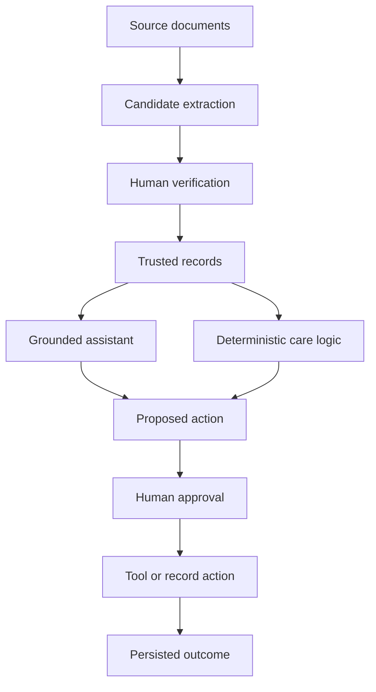

# TomoCare Operating Brief

**Working title:** Governed AI for proactive pet care
**Owner:** Rosa Choi
**Status:** Active personal and portfolio project
**Last updated:** August 13, 2026

---

## Purpose of this document

This is the durable operating brief for TomoCare. It defines the product thesis, system boundaries, governance model, strategic direction, and standards that should remain consistent as individual phases and implementation details evolve.

Use this document to:

- Orient a new working session or collaborator
- Evaluate proposed features and phase scope
- Keep product, technical, and portfolio decisions aligned
- Distinguish durable principles from temporary implementation choices
- Prevent the roadmap or public narrative from getting ahead of what has actually shipped

Changing care facts, active branch details, current database records, and near-term implementation tasks belong in the latest **Current State and Handover** document rather than here.

---

## Product in one sentence

TomoCare is a governed AI pet-care assistant that turns scattered records into verified memory, grounded guidance, and approval-gated actions without removing the human from consequential decisions.

## Personal origin

TomoCare began with a practical problem: Momo’s health history was distributed across vet receipts, lab reports, invoices, email, calendar entries, and Rosa’s memory. Questions such as when Momo received her last Librela injection, what care is due next, how her weight has changed, or whether an appointment has actually been scheduled required unnecessary reconstruction.

The project is intentionally personal and single-user. Momo provides a real longitudinal care context, real documents, real follow-through needs, and meaningful consequences when the system confuses a guess, reminder, appointment, or completed treatment.

## Larger purpose

TomoCare also serves as a portable reference implementation for governed AI systems. Pet care is the working domain, but the underlying patterns transfer to enterprise environments where AI-extracted information must be verified before it becomes operational truth or triggers an external action.

The project demonstrates product design at the architecture layer:

- What the AI may read
- What the system is allowed to trust
- Which calculations should remain deterministic
- What the AI may prepare
- What requires human approval
- How answers and actions remain traceable to evidence
- How system promises become testable through evals

---

## Core thesis

> AI can prepare; human approves.

TomoCare is designed around the belief that useful autonomy does not require hidden or unlimited autonomy. AI can ingest, extract, triage, retrieve, summarize, calculate, draft, and recommend. Humans retain control over promotion to trusted truth and consequential external action.

A second operating rule defines the division of responsibility:

> LLM interprets; database calculates; citations prove.

The language model may interpret intent and compose a useful response. Structured records and deterministic logic establish core facts, schedules, and state. Citations make provenance visible at the moment a user needs to trust the result.

---

## Product principles

### 1. Trust is a product behavior

TomoCare should not appear trustworthy because its language sounds confident. Trust comes from visible evidence, explicit state, clear limitations, and reliable behavior.

### 2. Source truth comes first

Original documents are preserved before model processing. Derived information must remain traceable to the source that produced it.

### 3. Candidate truth is not operational truth

AI extraction is probabilistic. Candidate records remain inspectable and editable until a human explicitly promotes them into trusted records.

### 4. Action follows trust

Raw extraction and loose chat context cannot authorize reminders, messages, appointments, calendar changes, or other external actions.

### 5. Planned is not the same as done

A reminder is not a completed treatment. A target administration date is not necessarily the cadence-based due date. A planned reminder is not a confirmed appointment. These distinctions must remain explicit in the data model, UI, assistant responses, and evals.

### 6. Deterministic before agentic

Known rules such as cadence calculations, timing windows, record state, and idempotency should be implemented deterministically. Models should not improvise logic that can be represented as inspectable code or structured data.

### 7. External action requires fresh authority

Displayed or cached state can become stale. Before an approved action touches an external system, TomoCare should recompute whether the action is still valid using current trusted data.

### 8. Safe fallback must be visible

When extraction, triage, retrieval, or an external integration fails, TomoCare should surface the limitation and fall back to human review. It should not silently substitute a less trustworthy behavior.

### 9. Evals are part of the product

Tests should express the promises TomoCare makes to its user: retrieve trusted facts, cite evidence, preserve date and state distinctions, abstain when evidence is missing, respect medical boundaries, and never execute an unapproved action.

### 10. Scope discipline protects the thesis

New technology or agent roles should be added only when they solve a demonstrated product or reliability problem. Architectural complexity is not itself evidence of intelligence or product value.

### 11. Visible product scope creates a knowledge obligation

When TomoCare shows governed information in Profile, Reminders, Inbox, Recently verified, or pending approvals, users will reasonably expect Tomo to understand it. That information does not all have the same authority: an Inbox document awaiting review is governed workflow state, but its extracted contents are still candidate truth. Assistant coverage must define what Tomo can answer, how fresh the source must be, which governing record or trusted evidence it references, and what it says when the visible data is not yet supported.

### 12. A skill may guide before it acts

TomoCare should help the user reach the relevant product or external tool without treating navigation as permission to change care state. A Calendar skill may open a stored event or the appropriate Google Calendar view. Creating, changing, or sending anything still follows the applicable approval and fresh-state rules.

---

## Governance model

### Truth states

| State | Meaning | Permitted use |
| --- | --- | --- |
| **Source truth** | Immutable original documents and source metadata | Inspection, extraction, and provenance |
| **Candidate truth** | AI-extracted structured information that may be incomplete or incorrect | Review, correction, triage, and debugging |
| **Trusted truth** | Human-verified structured records | Grounded answers, deterministic calculations, and approved downstream workflows |

### Action states

| Stored status | Meaning | System behavior |
| --- | --- | --- |
| **`proposed`** | TomoCare has prepared a reviewable action | Show the preview, payload, evidence, and expected result; do not change care state |
| **`approved`** | Rosa has authorized the reviewed proposal | Revalidate current trusted evidence before execution |
| **`executing`** | The trusted execution boundary has started | Prevent duplicate execution and preserve recoverable state |
| **`succeeded`** | The approved action completed | Persist the result and return it for repeat requests |
| **`failed`** | Execution could not complete safely | Preserve the failure and guide review or recovery without claiming success |
| **`cancelled`** | Rosa cancelled a proposal before approval | Preserve the decision without changing trusted care records |

### Native communication handoff

Opening an approved draft in Apple Messages is a handoff, not proof of delivery. TomoCare may prepare the exact message, verify the server-owned recipient, collect explicit approval, and open an editable native draft. Rosa remains the sender and makes the final send decision in Messages.

The durable state must describe only what TomoCare knows. `messages_handoff_requested` means the native handoff was requested; it does not mean sent, delivered, received, or booked. Any later sent state must come from an explicit owner report or a future trusted delivery integration.

### Assistant answer types

TomoCare should not treat every user message as the same kind of request. The current interaction model distinguishes:

- `grounded_answer`
- `no_trusted_data`
- `clarification_needed`
- `safety_boundary`
- `action_request`
- `message_draft_prepared`

Future answer or action types should be added deliberately and protected by evals.

---

## High-level system model

The assistant is a read and preparation layer over trusted records. It is not the system of record and does not bypass the action gate.

---

## Product experience

TomoCare should feel like a calm care desk rather than an autonomous black box.

The product experience should help Rosa understand:

- What arrived
- What needs review
- What became trusted
- What is due and why
- What has actually happened
- What TomoCare is proposing
- What requires approval
- What evidence supports an answer
- What the system does not know
- Where to go next when a reminder, record, approval, or external tool needs attention

The interface should hide unnecessary pipeline complexity while making consequential state and decisions legible.

---

## Current capability progression

### Phase 0 — Working Brain · Shipped

Established the provenance-first data foundation:

- Private document storage
- Auditable raw text
- Structured candidate extraction
- Normalized records linked to source documents
- Deterministic Librela scheduling
- Idempotent Google Calendar synchronization

**Phase thesis:** Build trustworthy memory before building the visible assistant.

### Phase 1 — Verification UI · Shipped

Created the human trust surface:

- Side-by-side source and candidate review
- AI-assisted field triage
- Correction before promotion
- Draft and verification states
- Human-controlled materialization into trusted records
- Persisted audit information

**Phase thesis:** The AI triages; the human decides.

### Phase 2 — Care Desk · Shipped

Turned the foundation into a usable governed product loop:

- Dedicated Gmail document intake
- Dashboard for inbox, review, reminders, and gated actions
- Post-verification next-step recommendations
- Persistent care reminders
- Approval-gated Google Calendar sync
- Duplicate prevention and stale-state action guards

**Phase thesis:** A governed AI product should feel useful before it feels conversational.

### Phase 3A — Grounded Read-Only Assistant · Shipped

Added the conversational layer deliberately late:

- Intent routing
- Retrieval from trusted structured records
- Grounded answers with citations and evidence cards
- Librela and home-medication schedule awareness
- Appointment-status distinctions
- Longitudinal weight awareness
- Care timeline summaries
- Medical and action safety boundaries
- Black-box regression evals

**Phase thesis:** The assistant becomes trustworthy because of the verified system underneath it, not because it is conversational.

### Phase 3B — Governed Actions · Shipped

Extended the assistant and dashboard into a shared approval-gated action system:

- Durable `care_actions` ledger and explicit lifecycle
- Medication confirmation from dashboard or assistant
- Atomic trusted writes for administration, reminder completion, and next scheduling
- Insurance-claim filing confirmation using the same lifecycle
- Pending-action state, cancellation, retry, and interrupted-flow recovery
- Home-medication Calendar sync with reauthorization guidance
- Editable Librela appointment-request draft with no sending capability
- Deterministic tests plus live read-only assistant evals
- Suite-level proof that evals do not change the pending-action ledger

**Phase thesis:** The assistant may prepare the state transition; the human authorizes it.

### Phase 3C — Approved Messaging Foundation · Shipped

Established the governed communication and orchestration boundary:

- Exact-message review and approval contract
- Persistent workflow state, recovery, and orchestration handoffs
- Mock delivery for safe end-to-end validation
- Server-side provider boundary and Twilio self-test as architectural proof
- Stable `care_action_id` across the coordinated workflow
- Explicit separation between approval, handoff, provider delivery, and reply interpretation

The project later chose native Apple Messages instead of live Twilio delivery for its single-user workflow. The Twilio account was closed, and provider delivery is not current roadmap work. Phase 3C remains shipped evidence of the governed messaging boundary; it is not a claim that clinic messages were delivered.

**Phase thesis:** External communication requires exact approval and truthful, traceable state.

### Phase 3D — Conversational Tomo · Shipped

Made conversation the primary product surface without moving the trust or action boundary:

- Schema-constrained semantic interpretation inside the supported intent map
- One-topic session context and a shared Voice/Chat transcript
- Bounded relationship profile and personality around unchanged grounded answers
- Voice capture, care-vocabulary handling, automatic stop, concise speech, and recoverable playback
- Conversation-centered home with accessible care, transcript, and evidence panels
- Optional Runway + LiveKit lip-sync downstream of TomoCare's completed speech
- Pose-matched local motion with one-shot playback and final-frame holds
- Static and local-audio fallback when live animation is unavailable or reduced motion is preferred
- Numeric-only latency instrumentation that excludes care content and identifiers

**Phase thesis:** Character and voice may change how TomoCare feels without changing what it knows or what it may do.

### Phase 3E — Lifecycle Integrity, Assistant Coverage, and Governed Skills · In progress

Phase 3E first hardened the lifecycle underneath Tomo's answers and actions:

- **3E.0a–3E.0e shipped:** post-verification eligibility and authorization recovery, Librela reconciliation, Calendar recovery, verified weight materialization, and a golden idempotent Librela lifecycle
- **3E.1a shipped:** trusted Librela state through grounded answer, approved draft, verified recipient, and native Messages handoff intent
- **3E.2 shipped:** shared Simparica and Adequan home-medication lifecycle with explicit confirmation, one atomic trusted write, reminder completion, exactly one cadence-based successor, Calendar sync, grounded answers, and idempotent retry behavior

The next bounded slice is **3E.3 — Attention and Governed Navigation**:

- Answer “What needs my attention?” from current server-owned state rather than screen text or loose memory
- Start with due or overdue reminders, pending or recoverable care actions, and documents awaiting verification
- Rank no more than five supported items deterministically and explain why each item needs attention
- Reference the governing reminder, action, or review document without presenting candidate document contents as verified facts
- State when a supported source is unavailable rather than silently treating it as empty
- Open the relevant TomoCare reminder, approval, or review surface; a qualifying reminder may also open its stored Google Calendar event or Calendar generically when no event URL exists
- Keep navigation distinct from creating, changing, completing, approving, or sending anything

Calendar navigation is supported by persisted reminder metadata. A browser-session Calendar error is not durable attention state and should not be presented as recoverable after refresh unless a later slice persists that failure. Appointment-state aggregation and recently verified follow-up are also deferred until the first attention contract is proven.

Broader coverage for Profile, Reminders, Inbox, Recently verified, appointments, and pending approvals remains Phase 3E work and should be added as bounded, tested slices rather than one broad knowledge claim.

Meaning-based `happy`, `laughing`, and `oops` reactions remain planned character work. They should map only to harmless conversational meaning and must not alter facts, medical restraint, action status, or tool authority.

**Phase thesis:** If TomoCare shows it, Tomo should know whether it can explain it and guide the user to the next governed step.

### Phase 3F — Native Apple Messages Handoff · Shipped

Replaced provider-dependent clinic delivery with a simpler single-user handoff that preserves the human boundary:

- Tomo prepares the exact clinic message from trusted state
- The server owns and verifies the recipient; the browser receives only masked recipient details
- Rosa reviews and explicitly approves the message
- Native Apple Messages opens an editable draft on the Mac
- Rosa remains responsible for the final send
- Copy fallback and idempotent recovery remain available
- TomoCare records handoff intent without claiming sent, delivered, received, or booked

Live Twilio delivery is no longer planned for the current product. Reconsider a messaging provider only if TomoCare develops a real multi-user, high-volume, or independently verifiable delivery need.

**Phase thesis:** The smallest truthful external handoff is better than provider complexity the product does not need.

### Phase 4 — Generalized multi-agent care operations

TomoCare is being built toward a governed multi-agent system, but specialized agents and orchestration should be introduced only when the product needs genuine role separation, independent tool boundaries, or coordination across workflows.

Possible future roles include record processing, care planning, communication preparation, and evaluation. A role should not become a separate agent merely to make the architecture appear more advanced.

**Decision gate:** Add each specialist role when it makes responsibility, context, permission, or recovery clearer than the current modular architecture.

---

## Current product boundaries

TomoCare is:

- A personal, single-user, local-first system
- A governed assistant over real pet-care records
- A working environment for designing trustworthy AI behavior
- A portfolio demonstration of product, system, interaction, and eval design
- A reference pattern intended to transfer to higher-consequence enterprise workflows

TomoCare is not:

- A veterinary diagnostic tool
- A replacement for clinical judgment
- An autonomous care provider
- A multi-tenant consumer product
- A source of medication dosing or treatment-change recommendations
- Authorized to send, book, sync, or mutate consequential state without the appropriate approval

---

## Medical and safety boundaries

TomoCare may:

- Retrieve and summarize verified records
- Describe factual trends in verified data
- Calculate deterministic schedules
- Identify missing trusted information
- Help prepare questions or drafts for a veterinarian
- Suggest that a verified pattern may be worth discussing with a vet

TomoCare may not:

- Diagnose a condition
- Determine whether a medical trend is clinically concerning
- Recommend changing a medication dose or treatment plan
- Invent an explanation for symptoms or abnormal results
- Claim an appointment, treatment, or medication administration occurred without trusted evidence
- Execute an action directly from conversational input

---

## Success measures

Because TomoCare is a single-user project, measures should remain lightweight, auditable, and connected to real product value.

### Trust and correctness

- Every operational record traces back to a source or explicit owner confirmation
- Grounded assistant answers cite trusted evidence
- Candidate extraction never silently becomes trusted truth
- Missing evidence results in abstention or clarification rather than invention

### Action governance

- Zero unapproved external actions
- Zero direct database mutation from an assistant query
- Approved actions execute only the reviewed payload
- Action results and failures remain traceable
- Fresh trusted evidence is checked again before execution

### Reliability

- Repeated runs update existing state rather than create duplicates
- Known workflows have deterministic tests
- Core assistant and action promises are represented in regression evals
- Live evals run in read-only mode and leave the action ledger unchanged
- Failures remain visible and recoverable

### Usefulness

- Reduced effort to answer “what happened, what is due, and what should I do next?”
- Reduced manual reconstruction across documents, email, and calendar
- Faster transition from a verified record to the appropriate next step
- Increased confidence in care state without creating notification fatigue

### Portfolio proof

- Each phase demonstrates a distinct product and architecture decision
- Shipped behavior is separated clearly from roadmap intent
- Technical implementation is connected to user value and risk
- The final story demonstrates transferable governed-AI patterns rather than pet-care novelty alone

---

## Portfolio positioning

TomoCare is Rosa’s flagship example of designing at the architecture layer of AI products. The strongest story is not “I built a chatbot for my dog.” It is:

> I designed and built the governed system underneath an AI assistant: how messy information becomes trusted memory, how the assistant proves what it knows, how deterministic and model-based reasoning work together, and how proposed actions remain under human control.

The portfolio narrative should remain personal first and technical second. It should open with Momo and the real care problem, then reveal the transferable system patterns.

Current public claims should distinguish shipped capability from architectural direction. TomoCare now has approval-gated internal actions, verified lifecycle writes, grounded chat and voice, a native Apple Messages draft handoff, and optional live character animation. The handoff is not evidence that a message was sent, delivered, received, or converted into a booking. Inbound reply interpretation and broader assistant coverage remain unfinished. Describe TomoCare as a governed AI assistant; multi-agent orchestration is a future design direction, not a current capability.

---

## Phase decision framework

Before adding a phase or meaningful slice, answer:

1. What real user problem does this solve for Rosa and Momo?
2. What new system capability does it prove?
3. Why is this the smallest meaningful vertical slice?
4. What source or trusted state authorizes the behavior?
5. Where does human approval belong?
6. Which part should be deterministic?
7. What could the system confuse, overclaim, duplicate, or execute incorrectly?
8. What evidence and evals will prove the boundary holds?
9. What is explicitly out of scope?
10. What does this add to the overall portfolio story that earlier phases did not already prove?

If a proposed slice cannot answer these questions clearly, it is not ready to build.

---

## Definition of done for a phase or slice

A TomoCare phase or meaningful slice is complete when:

- The intended user loop works end to end
- Trusted, planned, approved, and completed states remain distinguishable
- Safety and approval boundaries are enforced in the backend, not only communicated in the UI
- Relevant regression and integration evals pass
- Database and external-tool effects have been inspected
- Provider cost or credits are recorded when a paid integration is part of the phase, or the missing evidence is stated plainly
- Idempotency or duplicate behavior has been tested where applicable
- Known limitations and deferred scope are documented
- Key product and architecture decisions are captured
- Screenshots or video evidence are collected before moving on
- The case study evidence pack and next-phase handover are updated

---

## Operating cadence

Use four collaboration modes:

### Strategy mode

Define the product decision, options, tradeoffs, trust boundary, scope, and success criteria.

### Build mode

Inspect the current implementation, make incremental changes, explain important code and architecture decisions, and verify behavior proportionate to risk.

### Closeout mode

Confirm what shipped, run evals, collect evidence, update the phase narrative, and prepare the next handover.

### Executive narrative mode

Translate completed work into the concise system-level story used for interviews and the final interactive HTML leave-behind.

---

## Source hierarchy

When TomoCare documents disagree, use this order:

1. Current code, database behavior, and passing evals
2. Latest Current State and Handover document
3. This Operating Brief for durable principles and strategy
4. Completed phase case studies for the historical story of each phase
5. Older project briefs, roadmap language, and portfolio introduction copy

Historical case studies should preserve the decisions and learning of their phase. Global phase navigation, project status, and public overview language should be updated as the product evolves.

---

## Durable phrases

These phrases express the TomoCare product philosophy and may be reused when appropriate:

> AI can prepare; human approves.

> LLM interprets; database calculates; citations prove.

> The AI triages; the human decides.

> Action follows trust, not extraction.

> Planned is not the same as done.

> Trust is a product behavior, not a tone.

> The assistant does not become trustworthy because it is conversational. It becomes trustworthy because it is bounded by verified records, provenance, deterministic care logic, and explicit safety rules.

---

## Maintenance rule

Update this brief only when the durable product strategy, governance model, phase structure, positioning, or definition of done changes.

Do not update it for ordinary implementation progress, new care dates, temporary bugs, branch names, or individual task lists. Record those in the Current State and Handover document.
